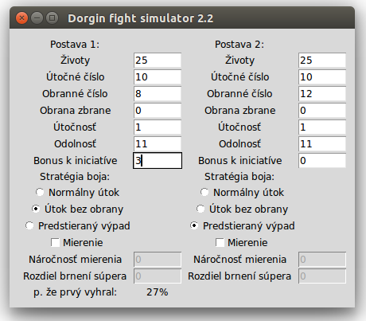

Dorgin Fight Simulator
======================

Description
-----------

`Dorgin fight simulator` is an application which simulates the probable outcome of a fight in the popular game "Dračí doupě".

The GUI uses Tkinter package and threading is used to make the UI responsive.

Running
-------
	python3 Dfs.py

Dependencies
------------
	python3